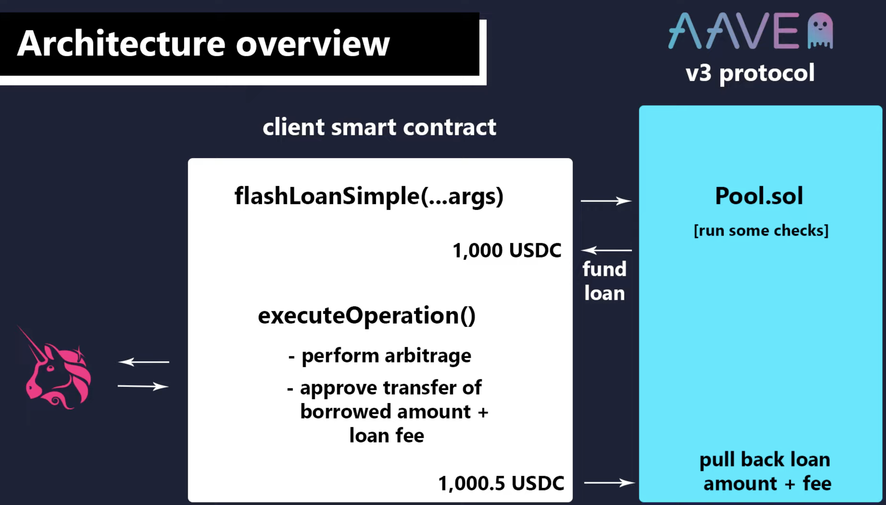
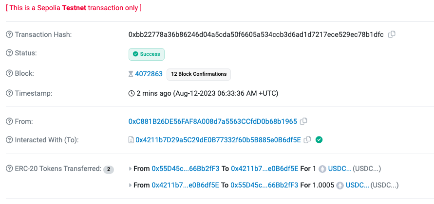

# Sample Flashloan Project (Hardhat)

**My attempt to try execute a FlashLoan on a testnet + walkthrough.**

for this example, we will only be using **flashLoanSimple(...args)** to borrow 1 type of token for simplicity.

- **flashLoan(..args)**: to borrow multiple assets at a time.
- **flashLoanSimple(...args)**: to borrow a single type of asset.

## Execution Flow



## SettingUp: Start hardhat & install packages:

> npx hardhat

Install Aave packages & dotenv:

> npm i @aave/core-v3 dotenv

then proceed to setup .env file & put in all the privateKeys & endpoints.

hardhat.config.js:

- add the "require("dotenv").config();" to be able to access .env
- add & configure the networks (for easy access, and linking it to the RPC & Account's privateKey):

```javascript
require("@nomicfoundation/hardhat-toolbox");
require("dotenv").config();

/** @type import('hardhat/config').HardhatUserConfig */
module.exports = {
  solidity: "0.8.19",
  networks: {
    sepolia: {
      url: process.env.SEPOLIA_RPC_URL,
      accounts: [process.env.PRIVATE_KEY],
    },
  },
};
```

## Creating the FlashLoan.sol

do the required imports from @aave, such as the {FlashLoanSimpleRecieverBase},{IPoolAddressProvider}, {IERC20}.

- {FlashLoanSimpleRecieverBase} implement the IFlashLoanSimpleReceiver interface in order for our smart contract to be a reciever of the loan. The interface is also where the `executeOperation` is located, and two getter functions, `ADDRESS_PROVIDER()` AND `POOL()`. This base contract then helps to do the implementations for us so all we need to do is inherit from this contract, and pass in the ADDRESS_PROVIDER address, for the test network we are on, and the rest will be taken care of for us.
- {IERC20} is needed because we need to call the `approve()` function on the token we are borrowing.

```
// SPDX-License-Identifier: MIT
pragma solidity ^0.8.19;

import {FlashLoanSimpleReceiverBase} from "@aave/core-v3/contracts/flashloan/base/FlashLoanSimpleReceiverBase.sol";
import {IPoolAddressesProvider} from "@aave/core-v3/contracts/interfaces/IPoolAddressesProvider.sol";
import {IERC20} from "@aave/core-v3/contracts/dependencies/openzeppelin/contracts/IERC20.sol";
```

### continue to create the contract.

```
contract FlashLoan is FlashLoanSimpleReceiverBase{
    address payable owner; //we want to be able to withdraw fund from this contract, cuz there should be profits, and we want to implement a withdrawal function where only Owner can withdraw.

    constructor (address _addressProvider) FlashLoanSimpleReceiverBase(IPoolAddressesProvider(_addressProvider))
}
```

since for contructor, we need to pass the \_addressProvider in the deployment script, so we go set it up.

### deployFlashLoan.js

we create the script to deploy and set up the Flashloan contract.

deployFlashLoan.js

```javascript
const hre = require("hardhat");

async function main() {
  const FlashLoan = await hre.ethers.getContractFactory("FlashLoan"); //<< put in the Contract Name.

  // Deploy FlashLoan contract with the arguments for the contructor.
  const flashLoan = await FlashLoan.deploy(
    "0x0496275d34753A48320CA58103d5220d394FF77F"
  ); // Address of "PoolAddressProvider-Aave" (Of Testnet) https://docs.aave.com/developers/deployed-contracts/v3-testnet-addresses

  await flashLoan.deployed();
  console.log("Flash Loan Contract deployed: ", flashLoan.address);
}

// We recommend this pattern to be able to use async/await everywhere
// and properly handle errors.
main().catch((error) => {
  console.error(error);
  process.exitCode = 1;
});
```

### Back to "FlashLoan.sol"

- setup "owner" as msg.sender in constuctor, so only we as owner can withdraw profits from contract
- _override_ our `executeOperation()` , and write out our custom logic for our flashloan inside it.

```// SPDX-License-Identifier: MIT
pragma solidity ^0.8.19;

import {FlashLoanSimpleReceiverBase} from "@aave/core-v3/contracts/flashloan/base/FlashLoanSimpleReceiverBase.sol";
import {IPoolAddressesProvider} from "@aave/core-v3/contracts/interfaces/IPoolAddressesProvider.sol";
import {IERC20} from "@aave/core-v3/contracts/dependencies/openzeppelin/contracts/IERC20.sol";

contract FlashLoan is FlashLoanSimpleReceiverBase{
    address payable owner; //we want to be able to withdraw fund from this contract, cuz there should be profits, and we want to implement a withdrawal function where only Owner can withdraw.

    constructor (address _addressProvider) FlashLoanSimpleReceiverBase(IPoolAddressesProvider(_addressProvider)) {
        owner = payable(msg.sender);
    }

    function executeOperation(
        address asset,
        uint256 amount,
        uint256 premium,
        address initiator,
        bytes calldata params
    ) external override returns (bool){
        // we have the borrowed funds
        // add any custom logic (example mock arbitrage)

        // this part then returns it back to the pool.
        uint256 amountOwed = amount + premium; // the amt we need to approve for the pool contract.
        IERC20(asset).approve(address(POOL),amountOwed); // the POOL variable is already setup in "FlashLoanSimpleReceiverBase", via the IPool, and that gives us access to POOL.
        return true;
    }

    // this is going to wrap the actual function call to the pool contract.
    function requestFlashLoan(address _token, uint256 _amount) public {
        address receiverAddress = address(this);
        address asset = _token;
        uint256 amount = _amount;
        bytes memory params = "";
        uint16 referralCode = 0;

        POOL.flashLoanSimple(
            receiverAddress,
            asset,
            amount,
            params,
            referralCode
        );

    }

    modifier onlyOwner() {
        require(msg.sender == owner, "Only contract owner can call this function");
        _;
    }


    // writing some utility funcs that will help us for testing
    // 1) use this at the very end, after the flashLoan is completed to see what is the balance
    function getBalance(address _tokenAddress) external view returns (uint256) {
        return IERC20(_tokenAddress).balanceOf(address(this));
    }

    // 2) for withdrawal, onlyOwner can withdraw.
    function withdraw(address _tokenAddress) external onlyOwner {
        IERC20 token = IERC20(_tokenAddress);
        token.transfer(msg.sender, token.balanceOf(address(this)));
    }

    receive() external payable {}

}
```

Deploy the contract & check if it can compile with

> npx hardhat run --network sepolia scripts/deployFlashLoan.js

FlashLoan Contract deployed: 0x4211b7D29a5C29dE0B77332f60b5B885e0B6df5E
// This FlashLoan Contract do not have a custom logic, so it's just purely recieve the funds, approve the payback and then pay it back to the pool. There is a small fee, so I send over say 1 USDC to the contract, so it can pay aave.

sepolia USDC's address: 0xda9d4f9b69ac6C22e444eD9aF0CfC043b7a7f53f

when we call:
`requestFlashLoan(0xda9d4f9b69ac6C22e444eD9aF0CfC043b7a7f53f, 1000000)` 1000000 means 1 USDC , because USDC unlike others(18), has 6 decimals.


we can see:

- our contract borrowed 1 USDC from the pool, and paid back 1.0005 USDC
- fees is 0.0005 USDC
- if 20 USDC, then 0.01 USDC as fee.

## Now,to actually perform a FlashLoan, and Execute it with out Logic

### 1) we use an example "DEX" for us to execute a flashloan trade (Dex.sol)

we set up -> Dex.sol, which is simulated a decentralized exchange.

- 2 tokens (Dai & USDC)

First User would approve a deposit for the token they want to work with.

- user first deposit e.g USDC,
  so this contract can custody different erc20 tokens on the user's behalf
- buy Dai token (at $0.90), deposit Dai, then sell Dai (at $1.00) for a profit.

we wrote a script called "deployFakeDex.js", and then run:

> npx hardhat run --network sepolia scripts/deployFakeDex.js

and we got

> FakeDex Contract deployed: 0xB8De86Fce1BDE6e3D33CEb00C4e3F0c7D5C6752d

### 2)Create Custom FlashLoanArbitrage.sol (modified from FlashLoan.sol)

See the file:
FlashLoanArbitrage.sol
